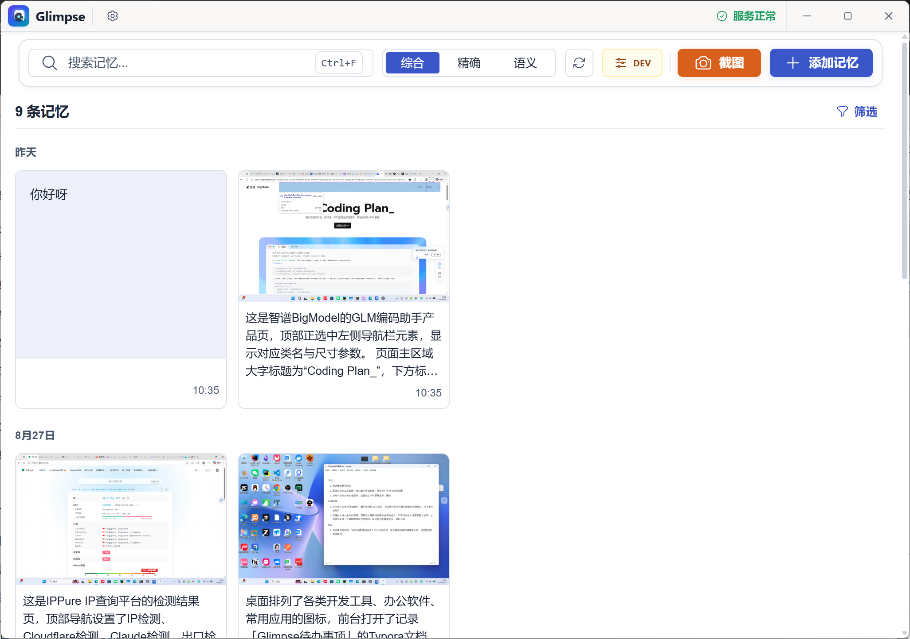
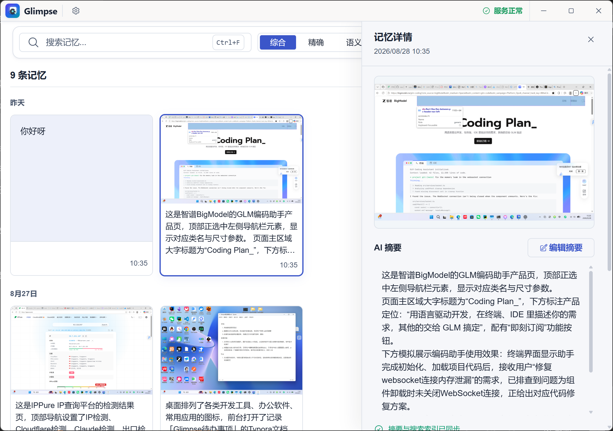

# Glimpse

**一款放在桌面上的记忆助手：随手截图、随手记一句话，之后用一句话就能找回来。**

你一定有过这种时刻：刚在屏幕上看到一段有用的内容，几分钟后想再找，却完全记不起它在哪。Glimpse 解决的就是这件事——按下快捷键截取屏幕，它会自动认出里面的文字、生成一句摘要、存进本机；等你想找的时候，输入几个关键词，或者用一句自然的话描述"大概是讲什么的"，就能把它翻出来。

## 界面预览





## 它能做什么

- **轻松记录**：全局快捷键一键截屏，主窗口自动最小化，不打断手头的事；不想截图就点"添加记忆"，直接输入文字
- **两种找法**：记得关键词就搜关键词；只记得大意，就用一句话描述，按意思找
- **连拍合并**：连续截几张相关的图，自动合并成一条记忆
- **全部在本地**：截图、摘要、索引都保存在你自己的电脑上，不需要注册任何账号
- **中英双语**：界面支持中文和英文

## 三步上手

### 第 1 步：下载安装

前往 [GitHub Releases](https://github.com/xiaofeng-iii/Glimpse/releases) 下载 Windows 安装包（`.exe`），双击安装即可。日常使用建议选正式版（`vX.Y.Z`）；带 `-preview` 字样的是抢先体验版，功能更新但可能不稳定。

数据保存在 `%LOCALAPPDATA%\Glimpse\GlimpseData`，删除这个文件夹就能彻底清除所有数据。后台有一个名为 `GlimpseRuntime.exe` 的服务进程（"Glimpse 核心服务"），随主程序一起启动和退出。

### 第 2 步：（可选）接入 AI 摘要

不配置 AI 也完全可以使用——Glimpse 会用本地文字识别生成基础摘要。想要更聪明的总结，打开 Glimpse 的设置页，在 AI 服务里填入三项：

- **API Key**：你在 AI 服务商那里申请的密钥
- **Base URL**：服务接口地址，用 OpenAI 官方服务保持默认即可
- **模型**：要使用的模型名；豆包 / Ark 这类平台要填"实际可调用的模型或 endpoint ID"，不要填控制台里的展示名称

任何 OpenAI 兼容的平台都可以使用。填好后用设置页的测试按钮验证能否连通，保存即生效。

习惯用配置文件的，也可以改用 `.env` 文件配置，见下文[从源码运行](#从源码运行)一节。

### 第 3 步：开始使用

- 按全局快捷键截图（快捷键可在设置页查看和修改）
- 或者点首页的"添加记忆"，直接输入文字
- 需要找东西时，在顶部搜索框输入关键词或一句话
- 首次启动会有一段三步使用引导，跟着走一遍就熟悉了

## 数据与隐私

- 截图、摘要、识别出的文字、搜索索引全部保存在本机，不依赖任何云端账号
- 文字识别和语义搜索的计算都在本地完成，不上传
- 只有配置了 AI 之后，截图才会发送给你自己配置的那个 AI 服务用于生成摘要；不配置 AI，整个应用完全离线可用

## 当前状态

Glimpse 还在活跃开发中，几点诚实说明：

- 自动识别"截图来自哪个应用"还没做好，多数记录的应用名显示为 unknown
- 仓库里保留了一个旧版桌面界面，只用于调试，正式功能都在新界面里
- 第一次做语义搜索前需要加载模型，会稍等片刻

遇到问题欢迎提 [Issue](https://github.com/xiaofeng-iii/Glimpse/issues)。

## 从源码运行

### 环境要求

- Python `3.10` / `3.11`（推荐 `3.10`）、Node.js `18+`
- 运行桌面版另需 Rust 工具链（`rustup` / `cargo`）和 Windows 的 MSVC C++ 工具链（推荐 Visual Studio 2022 Build Tools，勾选 "Desktop development with C++"）

### 安装依赖

```bash
pip install -r requirements.txt
```

```bash
cd glimpse-frontend
npm install
```

构建安装包另需 `pip install -r requirements-packaging.txt`。

### 配置

设置页里保存的 AI 配置优先级最高；也可以改用 `.env` 文件：复制 `.env.example` 为 `.env`，填写：

```env
OPENAI_API_KEY=你的密钥
OPENAI_BASE_URL=https://api.openai.com/v1
```

OpenAI 官方接口可不填模型；豆包 / Ark 等平台需加一行 `MODEL=模型ID`，填"实际可调用的模型或 endpoint ID"，不要填控制台展示名称。没有 AI 凭据也能启动。

### 启动

| 方式 | 命令 | 用途 |
|---|---|---|
| 桌面版（推荐） | `python main.py` | 启动桌面界面，后端自动拉起 |
| 只跑后端 | `python main_api.py` | API 开发，文档在 `http://127.0.0.1:8000/docs` |
| 网页开发 | `python main_api.py`，再 `cd glimpse-frontend && npm run dev` | 浏览器访问 `http://localhost:1420` |

也可以用根目录脚本：`start.bat`（一键启动桌面版）、`start_tauri_visible.bat`（带终端，方便排错）、`start_tauri.bat`（静默，日志在 `.logs/` 下）。注意 PowerShell 里要写成 `.\start_tauri.bat`。

### 常见问题

**`cargo` / `rustup` 找不到** —— 重开终端再试；仍找不到就确认 `C:\Users\<用户名>\.cargo\bin\cargo.exe` 存在，启动脚本会自动把它加进 `PATH`。

**`Port 1420 is already in use`** —— 有别的 `npm run dev` 在跑，关掉再启动。

**Tauri 启动"没反应"** —— 多半是用了静默脚本，报错被藏住了。改用 `start_tauri_visible.bat` 看报错，或查 `GlimpseData/logs/glimpse-sidecar.out.log`。

**快捷键、截图没反应** —— 确认顶栏显示"服务正常"、`http://127.0.0.1:8000/api/health` 返回 `healthy`。

### 打包安装包

```powershell
.\build_release.bat
```

版本号维护与正式发布流程见 [docs/RELEASE.md](./docs/RELEASE.md)。

## 了解更多

- [产品、架构与业务流程](./docs/README.md) —— 想深入了解 Glimpse 的实现，从这里开始
- [测试与验证](./docs/TESTING.md)
- [发布流程与版本管理](./docs/RELEASE.md)

API 的完整定义以运行时 FastAPI `/docs` 页面为准。

## 许可证

[MIT](./LICENSE)
