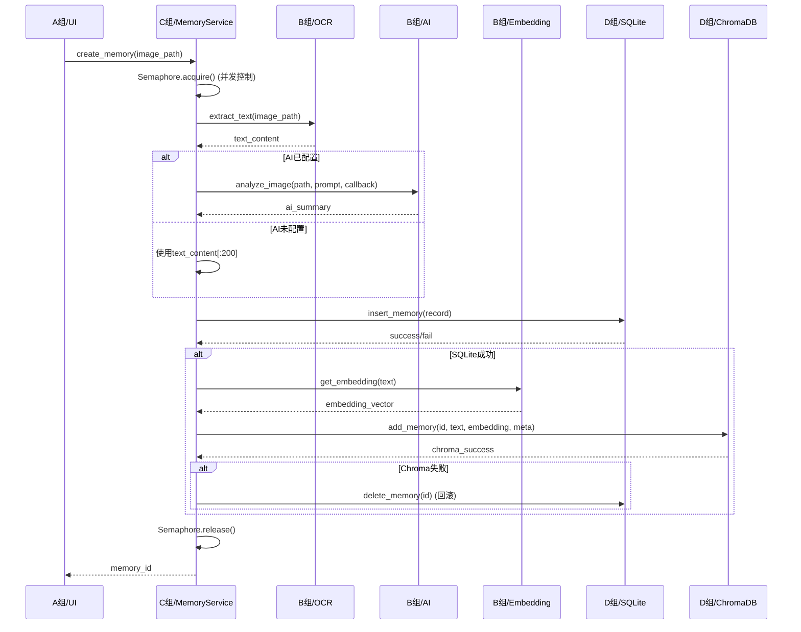
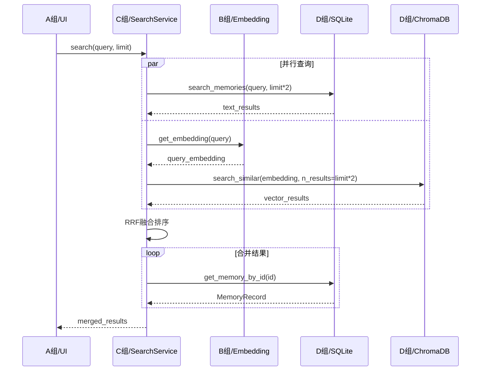

# C组（应用服务层）接口规范

> 归档状态：历史课程/团队协作材料，不是当前 v0.1.4 的接口事实来源。
> 当前产品与架构说明见 `docs/README.md`，现行 HTTP 接口见 FastAPI `/docs`。

> 版本: 1.0.0
> 维护者: C组
> 更新日期: 2026-04-10

---

## 1. 架构定位

```
┌─────────────────────────────────────────────────────────────┐
│                        A组 (UI层)                            │
│         main_window.py  ←  调用 C组提供的 API                 │
└────────────────────┬────────────────────────────────────────┘
                     │
┌────────────────────▼────────────────────────────────────────┐
│                      C组 (应用服务层)  ← 你在这里              │
│  ┌────────────────────┐    ┌────────────────────┐          │
│  │   MemoryService    │    │   SearchService    │          │
│  │   (记忆编排)        │    │   (搜索服务)        │          │
│  └────────┬───────────┘    └────────┬───────────┘          │
└───────────┼─────────────────────────┼──────────────────────┘
            │                         │
            ▼                         ▼
┌────────────────────┐    ┌────────────────────┐
│   B组 (核心/基础设施) │    │   D组 (数据层)      │
│  - OCR引擎           │    │  - SQLite         │
│  - AI客户端          │    │  - ChromaDB       │
│  - 任务队列          │    │                   │
│  - 截图管理          │    │                   │
└────────────────────┘    └────────────────────┘
```

---

## 2. C组对外提供的服务（供 A组调用）

### 2.1 MemoryService - 记忆生命周期管理

#### 概述
编排"截图 → OCR → AI分析 → 存储 → 索引"完整流程。

#### 导入方式
```python
from services.memory_service import memory_service
```

#### 方法列表

| 方法 | 功能 | 复杂度 |
|------|------|--------|
| `create_memory()` | 同步创建记忆 | 高（完整流程） |
| `create_memory_async()` | 异步创建记忆 | 高 |
| `delete_memory()` | 删除记忆 | 中 |
| `get_memory()` | 获取单条记忆 | 低 |
| `get_recent_memories()` | 获取最近记忆列表 | 低 |
| `get_active_count()` | 获取当前处理中任务数 | 低 |

#### 详细接口

##### `create_memory(image_path, app_name, stream_callback)`

**功能**：同步执行完整记忆创建流程（阻塞直到完成）

**参数**：

| 参数名 | 类型 | 必填 | 说明 |
|--------|------|------|------|
| `image_path` | str | 是 | 截图图片绝对路径 |
| `app_name` | str | 否 | 来源应用名，默认"unknown" |
| `stream_callback` | Callable[[str], None] | 否 | AI流式输出回调 |

**返回**：`Optional[str]` - 成功返回 memory_id，失败返回 None

**异常**：
- `RuntimeError`: 并发任务过多（>5）或处理失败

**示例**：
```python
from services.memory_service import memory_service

# 简单调用
memory_id = memory_service.create_memory(
    image_path="GlimpseData/screenshots/xxx.png",
    app_name="Chrome"
)

# 带流式回调
def on_stream(text_chunk):
    print(f"AI生成中: {text_chunk}")

memory_id = memory_service.create_memory(
    image_path="screenshot.png",
    app_name="VSCode",
    stream_callback=on_stream
)
```

---

##### `create_memory_async(image_path, app_name, on_complete, on_error)`

**功能**：异步创建记忆（非阻塞，后台执行）

**参数**：

| 参数名 | 类型 | 必填 | 说明 |
|--------|------|------|------|
| `image_path` | str | 是 | 截图图片绝对路径 |
| `app_name` | str | 否 | 来源应用名 |
| `on_complete` | Callable[[Optional[str]], None] | 否 | 完成回调，参数为 memory_id |
| `on_error` | Callable[[str], None] | 否 | 错误回调，参数为错误信息 |

**返回**：`None`

**异常**：
- `RuntimeError`: TaskQueue 未配置

**示例**：
```python
def on_done(memory_id):
    if memory_id:
        signals.memory_saved.emit(memory_id)
    else:
        signals.error_occurred.emit("创建失败")

def on_err(error_msg):
    signals.error_occurred.emit(error_msg)

memory_service.create_memory_async(
    image_path="screenshot.png",
    app_name="Chrome",
    on_complete=on_done,
    on_error=on_err
)
```

---

##### `delete_memory(memory_id)`

**功能**：删除记忆（同时删除 SQLite 和 ChromaDB）

**参数**：
| 参数名 | 类型 | 必填 |
|--------|------|------|
| `memory_id` | str | 是 |

**返回**：`bool` - 是否成功（任一数据库删除成功即返回 True）

---

##### `get_recent_memories(limit, offset)`

**功能**：获取最近的记忆列表

**参数**：
| 参数名 | 类型 | 必填 | 默认值 |
|--------|------|------|--------|
| `limit` | int | 否 | 100 |
| `offset` | int | 否 | 0 |

**返回**：`List[MemoryRecord]`

---

### 2.2 SearchService - 统一搜索服务

#### 概述
支持三种搜索模式：文本搜索（FTS5）、向量搜索（语义）、混合搜索（RRF融合）。

#### 导入方式
```python
from services.search_service import search_service
```

#### 方法列表

| 方法 | 功能 |
|------|------|
| `search(query, limit)` | 主搜索入口 |
| `set_search_mode(mode)` | 设置搜索模式 |
| `get_search_mode()` | 获取当前搜索模式 |
| `get_recent_memories(limit)` | 获取最近记忆 |
| `get_memory_by_id(id)` | 按ID获取 |

#### 搜索模式说明

| 模式 | 说明 | 适用场景 |
|------|------|---------|
| `text` | SQLite FTS5 全文搜索 | 关键词精确匹配 |
| `vector` | ChromaDB 向量相似度搜索 | 语义模糊搜索 |
| `hybrid` | RRF 融合排序（默认）| 综合效果最好 |

#### 详细接口

##### `search(query, limit)`

**功能**：执行搜索

**参数**：
| 参数名 | 类型 | 必填 | 默认值 |
|--------|------|------|--------|
| `query` | str | 是 | - |
| `limit` | int | 否 | 20 |

**返回**：`List[MemoryRecord]`

**示例**：
```python
from services.search_service import search_service

# 默认混合搜索
results = search_service.search("昨天查看的代码", limit=10)

# 切换模式
search_service.set_search_mode("vector")
semantic_results = search_service.search("登录页面相关")

# 切回混合
search_service.set_search_mode("hybrid")
```

---

## 3. C组依赖的其他组 API

### 3.1 D组（数据层）- 关键依赖

**状态**: ✅ 已稳定，接口已锁定

| 服务 | 方法 | 用途 | 调用位置 |
|------|------|------|---------|
| `SQLiteManager` | `insert_memory(record)` | 保存元数据 | memory_service:115 |
| | `delete_memory(memory_id)` | 删除元数据 | memory_service:165, search_service:回滚 |
| | `get_memory_by_id(id)` | 查询单条 | memory_service:169, search_service:66,97 |
| | `get_all_memories(limit, offset)` | 获取列表 | memory_service:172, search_service:103 |
| | `search_memories(query, limit)` | 文本搜索 | search_service:51,72 |
| `ChromaManager` | `add_memory(id, text, embedding, metadata)` | 向量索引 | memory_service:124 |
| | `delete_memory(memory_id)` | 删除向量 | memory_service:166 |
| | `search_similar(embedding, n_results)` | 向量搜索 | search_service:58 |

**数据结构 - MemoryRecord**：
```python
@dataclass
class MemoryRecord:
    id: str              # UUID
    created_at: str      # ISO格式时间
    image_path: str      # 截图路径
    ai_summary: str      # AI摘要
    app_name: str        # 应用名
    text_content: str    # OCR文本
    sync_status: str     # PENDING/SYNCED/FAILED
```

---

### 3.2 B组（核心/基础设施层）- 关键依赖

**状态**: ⚠️ 部分依赖外部API，需关注稳定性

| 服务 | 方法 | 用途 | 调用位置 |
|------|------|------|---------|
| `OCREngine` | `extract_text(image_path)` → str | 文字识别 | memory_service:91 |
| `AIClient` | `is_configured()` → bool | 检查配置 | memory_service:94 |
| | `analyze_image(path, prompt, callback)` → str | 生成摘要 | memory_service:96 |
| `EmbeddingClient` | `get_embedding(text)` → List[float] | 文本向量化 | memory_service:122, search_service:54,74 |
| `TaskQueue` | `submit(task)` | 提交异步任务 | memory_service:161 |

**重要说明**：
- `AIClient` 需要配置 API Key 才能使用，未配置时回退到 OCR 文本前200字
- `EmbeddingClient` 首次加载模型较慢（约 1-3 秒）

---

### 3.3 E组（配置层）

| 服务 | 方法 | 用途 | 调用位置 |
|------|------|------|---------|
| `SettingsManager` | `get(key, default)` | 读取配置 | main.py:50 |
| `PathManager` | 路径属性 | 获取数据目录 | D组使用，C组间接依赖 |

---

## 4. 依赖调用链详情

### 4.1 MemoryService.create_memory() 完整调用链



---

### 4.2 SearchService.search() 完整调用链（hybrid模式）



---

## 5. 接口变更通知机制

### 5.1 如果其他组需要修改 API

**请遵循以下流程**：

1. **发起变更请求** → 在钉钉/飞书群 @C组负责人
2. **C组评估影响** → 48小时内回复
3. **同步修改** → C组配合修改后双方联调
4. **文档更新** → 更新本文档版本号

### 5.2 变更影响等级

| 等级 | 说明 | 示例 | 处理时间 |
|------|------|------|---------|
| 🔴 **重大** | 接口删除或签名变更 | 删除 `insert_memory()` | 需协商，C组重构 |
| 🟡 **中等** | 返回值格式变更 | `search_memories()` 返回 dict 而非 list | 3天内适配 |
| 🟢 **轻微** | 新增可选参数 | `extract_text(path, lang)` | 1天内确认 |

---

## 6. 版本历史

| 版本 | 日期 | 修改内容 | 作者 |
|------|------|---------|------|
| 1.0.0 | 2026-04-10 | 初始版本，基于 DI 容器架构 | C组 |

---

## 附录 A：快速查询卡

### A组开发速查

```python
# 保存截图记忆
from services.memory_service import memory_service
memory_id = memory_service.create_memory(image_path, app_name)

# 搜索记忆
from services.search_service import search_service
results = search_service.search("关键词")

# 获取最近记忆
recent = search_service.get_recent_memories(limit=50)

# 删除记忆
memory_service.delete_memory(memory_id)
```

### B组/D组接口变更 checklist

变更前请确认：
- [ ] 方法签名是否兼容（参数/返回值）
- [ ] 异常类型是否变更
- [ ] 是否需要 C组 配合修改
- [ ] 是否更新了本文档

---

**文档维护**: 当接口变更时，请更新版本号并记录变更日志。
